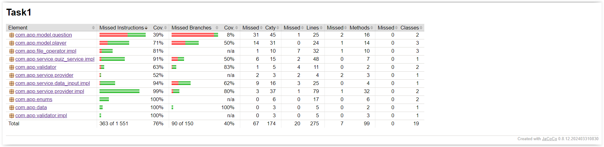

# Quiz

The project implements a quiz with questions and answers. The questions are divided by category and level of difficulty. Questions are loaded from a .csv file and can be downloaded from the user. Player scores are saved to a .csv file.
## Technologies and libraries used

* Java
* Maven
* Lombok
* JUnit
* AssertJ
* SLF4J
* Log4J

## Jacoco Coverage

## Required files

* Purchases file with pattern ( csv ):

  clientId;name;surname;age;money[productId;name;category;price productId;name;category;price]

## Description

### Retrieving questions and answers from a user:
* The user enters strings containing a question and answers until they enter an empty string.

### User quiz:

* The program asks the user to answer each of the saved questions.
* After each answer, it informs the user whether the answer is correct.
* Finally, the program summarizes the user's result.

### Extensions:
* Questions can be stored in a database or text file, allowing you to draw questions from a larger pool with each new game.
* Possibility to create a ranking of the best players with the results and game date saved in a text file or database.
* Function to display the best player overall or in a selected time frame.
* Question difficulty factors: ability to randomly select questions with different levels of difficulty.
* Question Categories: The user can select the category from which questions should come.

### Functionalities:
* Download questions and answers.
* Quiz with answer verification.
* Random questions from a database or file.
* Player ranking.
* Question difficulty factors.
* Question categories.